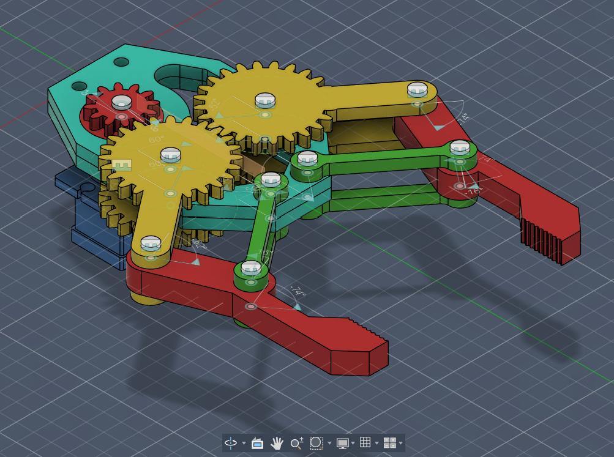
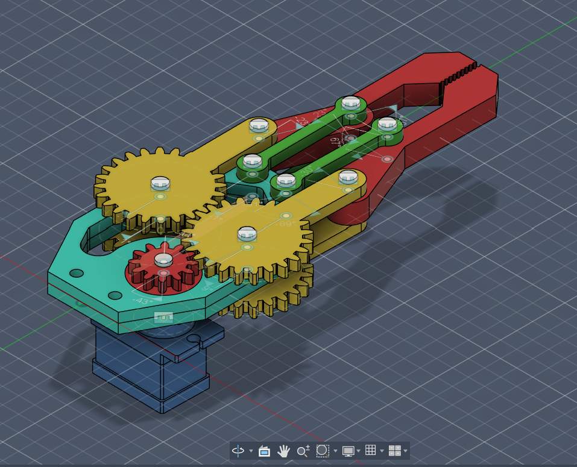
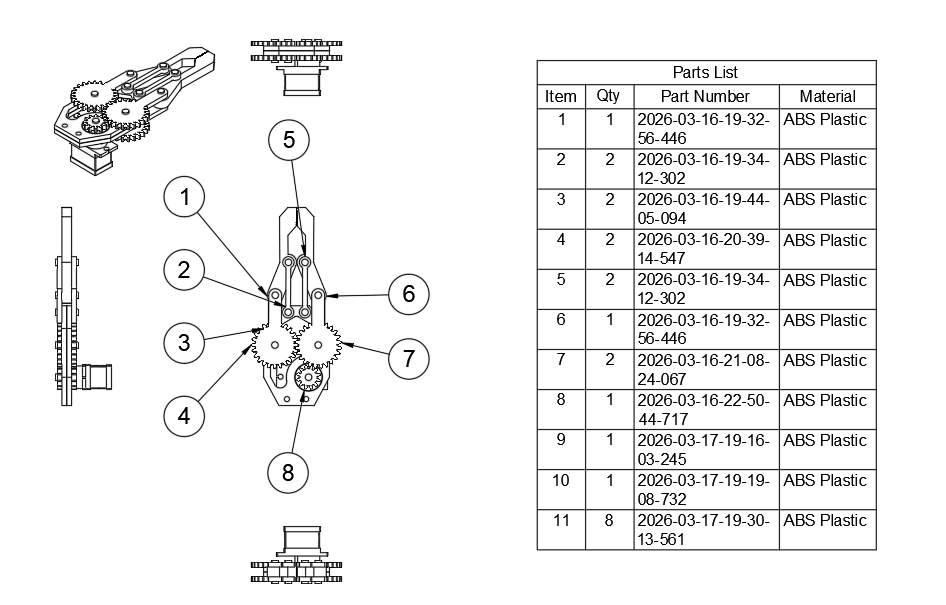

# 🤖 Gear-Driven Robotic Gripper

🚀 A servo-actuated robotic gripper designed using **Autodesk Fusion 360**, featuring a gear-driven mechanism and linkage system for precise and synchronized gripping motion.

---

## 📸 Preview

---

## 🧠 Project Overview

This project demonstrates the design of a **mechanical robotic end-effector** that converts rotational motion from a servo motor into controlled gripping action.

The system uses a **gear train + crank + linkage mechanism** to achieve smooth and parallel jaw movement, similar to industrial robotic grippers used in automation systems.

---

## ⚙️ Working Principle

**Servo Motor → Pinion Gear → Dual Spur Gears → Crank Arms → Linkage System → Parallel Gripper Jaws**

- The servo motor rotates the pinion gear  
- Motion is transferred to larger gears for torque amplification  
- Gears drive crank arms connected to linkages  
- Linkages convert motion into synchronized gripping action  

---

## 🔧 Key Features

- ⚙️ Gear-driven actuation for torque multiplication  
- 🔁 Four-bar linkage for smooth motion conversion  
- 🤝 Parallel jaw mechanism  
- 🧩 Fully assembled CAD design  
- 🎯 Servo motor integration  
- 🖨️ 3D printable components  

---

## 🛠️ Tools & Technologies

- Autodesk Fusion 360  
- Mechanical Design  
- CAD Assembly & Joints  
- Motion Simulation  
- 3D Printing (STL Export)  

---

## 🖨️ 3D Printing

All parts can be exported as:

**.STL (Binary format)**

Parts to be printed:

- Base x 2
- Gear lever x 4
- Gear Servo x 1
- Connector x 2
- Claw x 2
- Pin x 8
- Servo Motor x 1 (Optional)

Recommended settings:

- Layer Height: 0.2 mm  
- Infill: 30–50%  
- Material: PLA / PETG  

---

## 📸 Drawin & Bill Of Material - BOM

---

## 🎬 Animation

You can animate the mechanism in Fusion 360 using:

**Drive Joint / Motion Link**

---

## 🚀 Applications

- Pick and Place Robots  
- Industrial Automation  
- Educational Robotics  
- DIY Robotic Arms  
- Mechatronics Projects  

---

## 🙌 Author

**Aswin (Ash)**  
Electronics & Communication Engineer  
Passionate about Robotics, Embedded Systems & Automation  
